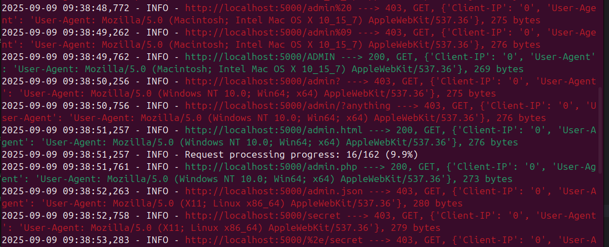

# Bypass 403
A flexible HTTP fuzzing tool for testing 403 restriction bypasses and analyzing server responses through various URL manipulations, HTTP methods, and header combinations.
## Features
- **URL Variation Testing**: 18 different URL encoding and path manipulation techniques
- **HTTP Method Fuzzing**: Test with `GET`, `POST`, `PATCH`, `HEAD`, and custom methods
- **Header Manipulation**: Bypass restrictions using headers like `X-Original-URL`, `X-Forwarded-For`, `Client-IP`
- **Batch Processing**: Memory-efficient processing of large path lists
- **Multi-threading**: Configurable thread count for performance optimization
- **Flexible Filtering**: Filter results by HTTP status codes
- **Output Options**: Save results to files for further analysis


## Requirements
- Python 3.7+
- Go version 1.23.4+ (for recon automation)

## Url variation techniques
The tool tests 18 different bypass techniques for each path:
```
/admin          → Standard path
/%2e/admin      → Dot encoding bypass  
/admin/.        → Trailing dot
//admin//       → Double slashes
/.../admin/...  → Dot directory traversal
///admin///     → Triple slashes
/admin..;/      → Semicolon bypass
/admin;/        → Path parameter
/admin\*        → Backslash wildcard
/admin/*        → Forward wildcard
/admin%20       → Space encoding
/admin%09       → Tab encoding  
/ADMIN          → Case variation
/admin?         → Query parameter
/admin/?test    → Query bypass
/admin.html     → File extension
/admin.php      → PHP extension
/admin.json     → JSON extension
```

Example output:
```
2025-08-31 15:56:05,994 - INFO - https://example.com/admin ---> 403, GET, {}, 1234 bytes
2025-08-31 15:56:05,995 - INFO - https://example.com/%2e/admin ---> 200, GET, {}, 5678 bytes
```


## Setup
Installation: 
```bash
./install/install.sh
```

## Usage 

### Basic Usage
Test single domain with default paths:

```python3
python3 -m src.main -d https://example.com
```

Test with custom path list:
```python3
python3 -m src.main -d https://example.com -pf fuzz-data/custom_path_list.txt
```

Test with a list of URLs:
```python3
python3 -m src.main -l urls.txt
```

Test with custom path list:
```python3
python3 -m src.main -l urls.txt -pf fuzz-data/custom_path_list.txt
```

Example run with a single domain:

```bash
python3 -m src.main -d https://example.com \
  -th 10 \           # 10 threads
  -dd 0.05 \         # 50ms delay between requests
  -bz 50 \           # Process 50 paths per batch
  -t 10              # 10 minute time limit
  -fs 200 403        # Filter based on statuscode
  -o results.txt     # Write to outputfile
```
Example run with a url list:
```bash
python3 -m src.main -l url_list.txt \
  -th 10 \           # 10 threads
  -dd 0.05 \         # 50ms delay between requests
  -bz 50 \           # Process 50 paths per batch
  -t 10              # 10 minute time limit
  -fs 200 403        # Filter based on statuscode
  -o results.txt     # Write to outputfile
```


Example output from a test on localhost:



### Command Line Options

| Option | Long Form         | Description                      | Example                    |
|--------|-------------------|----------------------------------|----------------------------|
| `-d`   | `--domain`        | Target base URL                  | `-d https://example.com`   |
| `-l`   | `--url-file`      | File containing complete URLs    | `-l urls.txt`              |
| `-pf`  | `--path_file`     | File containing paths to test    | `-pf custom_path_list.txt` |
| `-mf`  | `--method_file`   | File containing HTTP methods     | `-mf methods.txt`          |
| `-hf`  | `--header_file`   | File containing headers          | `-hf headers.txt`          |
| `-mh`  | `--max_headers`   | Max headers to iterate           | `-mh 10`                   |
| `-mm`  | `--max_methods`   | Max methods to iterate           | `-mm 10`                   |
| `-th`  | `--threads`       | Number of concurrent threads     | `-th 10`                   |
| `-dd`  | `--delay`         | Delay between requests (seconds) | `-dd 1`                    |
| `-bz`  | `--batch-size`    | Paths per batch                  | `-bz 100`                  |
| `-t`   | `--time`          | Time limit (minutes)             | `-t 10`                    |
| `-put` | `--per-url-time`  | Time limit (per url)             | `-put 10`                  |
| `-fs`  | `--filter-status` | Filter by status codes           | `-fs 200 403`              |
| `-o`   | `--output_file`   | Output file                      | `-o results.txt`           |
 

## Automated Reconnaissance
Full recon and fuzzing:
```
./scripts/recon.sh target.com
```

This performs:
- Shodan reconnaissance
- Subdomain discovery
- Automated fuzzing with multiple method/header combinations
- Results saved to `fuzzer_result/` directory


## Performance consideration
- Thread Count: Start with 5-10 threads, increase based on target capacity
- Delay: Use 50-100ms delay to avoid overwhelming servers
- Batch Size: Use 20-50 paths per batch for optimal memory usage
- Time Limits: Set reasonable limits based on target size

## Legal and Ethical Usage
This tool is intended for:
- Authorized penetration testing
- Security research on your own systems
- Educational purposes in controlled environments

**Important**: Only use this tool on systems you own or have explicit written permission to test. Unauthorized security testing may violate laws and terms of service.


## Contributing
Contributions or ideas are welcome. Please raise an issue or a pull request.
## License
This project is open-source and free to use under the MIT License.
